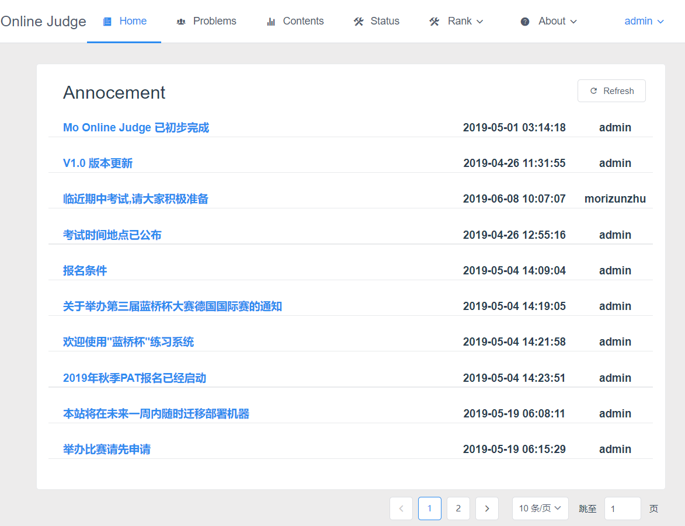
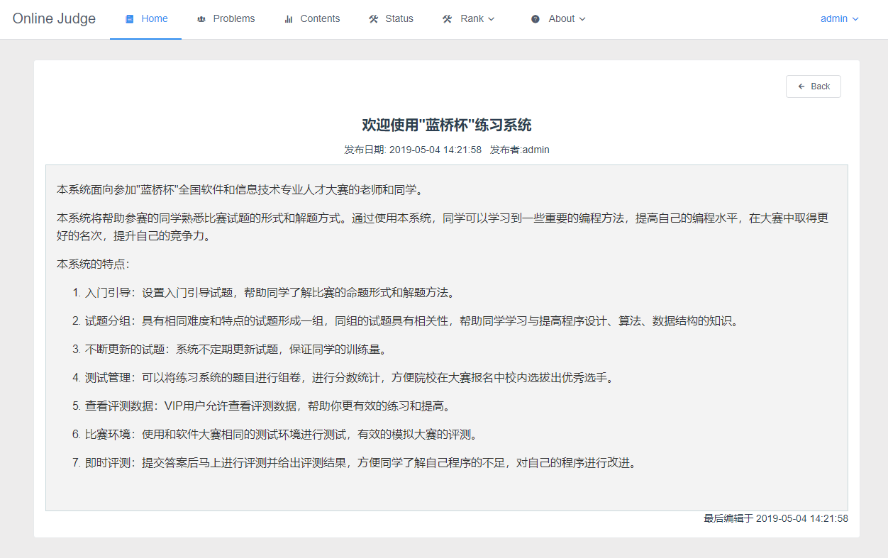
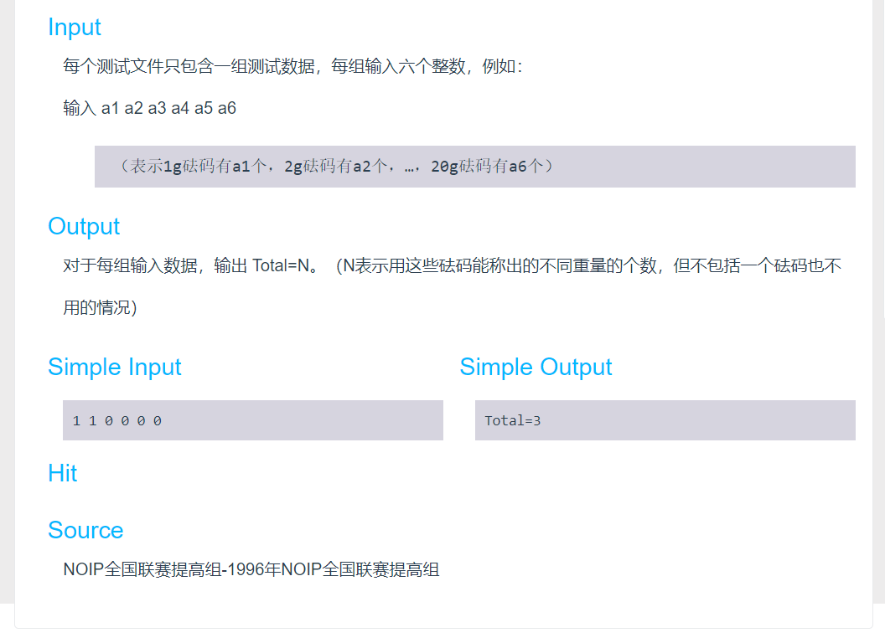
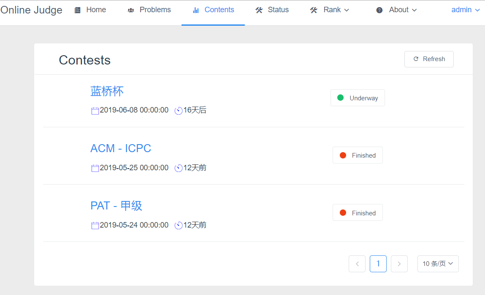
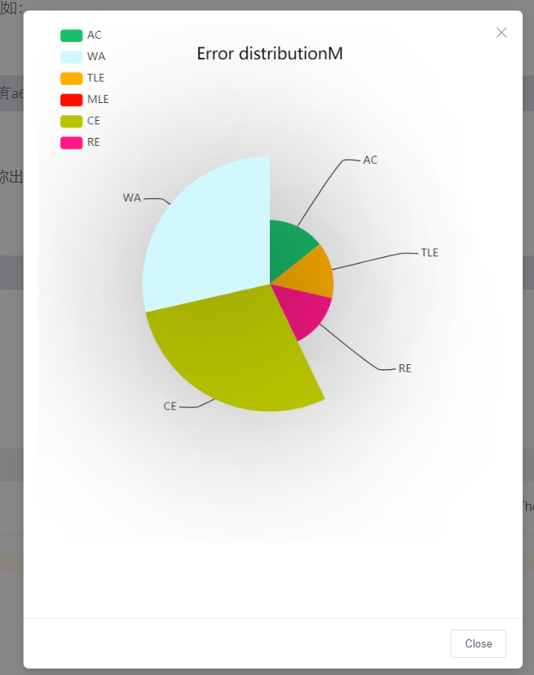
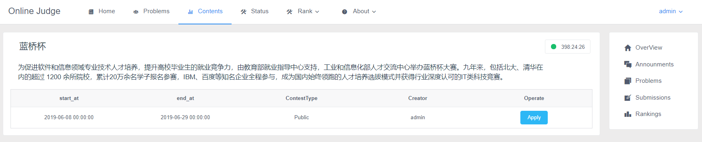
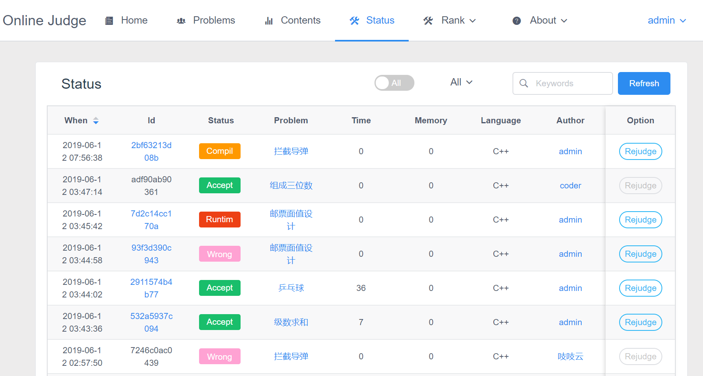
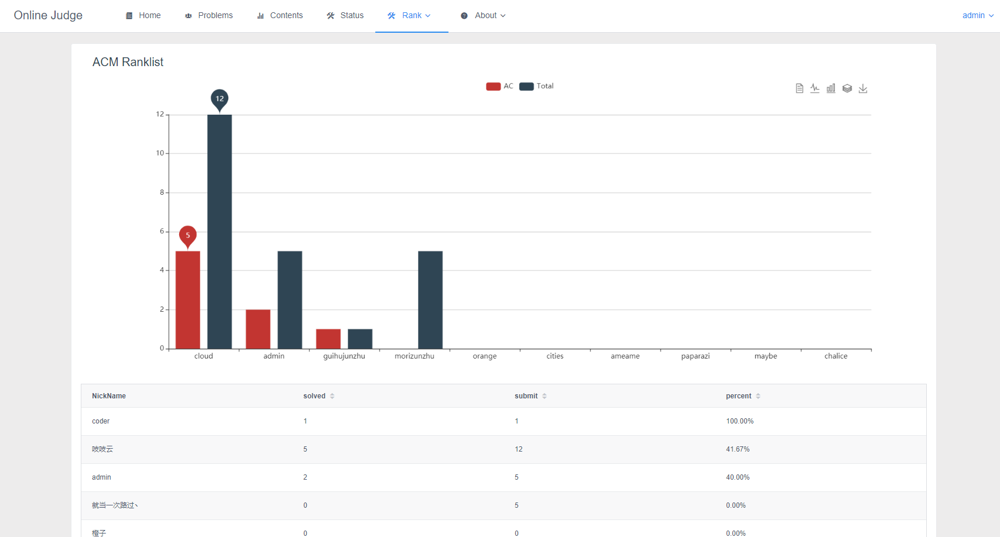

# Online Judge Web 端

很早就想自己写一个 OJ，趁着毕设的机会，手刃了一个垃圾版 OJ,判题部分代码见 [JudgeClient](https://github.com/Morizunzhu/JudgeClient)

## 简介

> 判题部分基于 Docker 和 linux C++
Web 端前后端分离，采用 Springboot 微服务和 Vue
图表生成用的 eCharts
前端 UI 用的 iview

## 前端

### 安装的插件

>axios 代替 jquery 的轻量级 ajax 插件
Simditor 富文本编辑器
codemirror 代码编辑器
echarts 生成图表插件
tar-simditor-markdown

### 遇到的坑

>`Simditor` 插件好像是模块化的，npm 装好了以后我一直不知道怎么使用，后来找到一个替代品 `tar-simditor`,如果需要支持 markdown，再装一个 `tar-simditor-markdown` 就行

>`跨域问题`

### 流程

前后端分离的话基本都差不多吧，我也不知道企业里是啥样的，没上过班。。后端提供接口，然后用 axios ajax 访问。

### 截图

>公告页面

>公告详情

>题目列表

>题目详情

>竞赛列表

>错误详细

>竞赛详情

>判题结果列表

>排名

>login

>register

## 后端

### 模块

#### 前台

>公告浏览
题目浏览
提交代码
排名浏览
竞赛的浏览和参与
登陆注册和个人信息编辑

#### 后台

>公告管理
用户管理
竞赛管理
题目管理

_系统管理_~(特别想做但是还没做的模块)~

### 使用的库

>com.alibaba.fastjson
io.jsonwebtoken.jjwt
com.alibaba.druid
ch.qos.logback.logback-classic
org.projectlombok.lombok

### 编码过程中踩的坑

>`fastJson不建立新对象可能会引起的循环引用`

>`IDEA 创建多模块的maven项目时的打包问题`

>`IDEA 创建多模块的maven项目子模块根目录问题`

## 特点

>权限鉴定

采用 JWT(Json Web Token) 验证,以 AOP 的方式执行验证

>主从数据库

双MySQL可以减小单个数据库的压力

>权限分类

+ Topic_adder 题目管理
+ Contest_organizer 竞赛组织
+ Contest_participant 竞赛参与者~(编码过程中没用到。。不知道设计的时候怎么想的)~
+ Code_viewer 代码查看
+ Manual_judger 远程判题~(没用到+1)~
+ Announcement_manager  公告管理
+ User_manager 用户管理

>判题结果

设计的时候基本感觉都想到了，但是没全部用，还不健全。仍需努力。。

|名称|描述|是否使用|
|:------:|:------:|:------:|
|OJ_WT0|Pending:等待判题|√|
|OJ_WT1|Waiting:排队中|x|
|OJ_CI|compiling:编译中|x|
|OJ_JI|Judging:运行中|x|
|OJ_AC|Accepted:答案正确|√|
|OJ_PE|Presentation Error:格式错误|x|
|OJ_WA|Wrong Answer:答案不对|√|
|OJ_TL|Time Limit Exceeded:运行超出时间限制|√|
|OJ_ML|Merrory Limit Exceeded:超出内存限制|√|
|OJ_OL|Output Limit Exceeded:输出超过限制|x|
|OJ_RE|Runtime Error:运行时错误|√|
|OJ_CE|Compile Error:编译错误|√|
|OJ_CO|Competition Over:竞赛结束|x|
|OJ_PA|Partial Accepted:部分正确|x|
|OJ_SE|System Error:系统错误|x|
## 数据库设计~(待写)~
>表名

|字段名|描述|
|------|---|
|-|-|
|-|-|

## 待实现
> 分布式文件系统FastDFS

>Docker-Compose搭建多容器

>添加更多的语言支持 JAVA等

>MySQL读写分离

## 如何运行
>将web后端和前端跑起来
>将linux的docker 跑起来
暂时写这么多，回头再改吧。。
